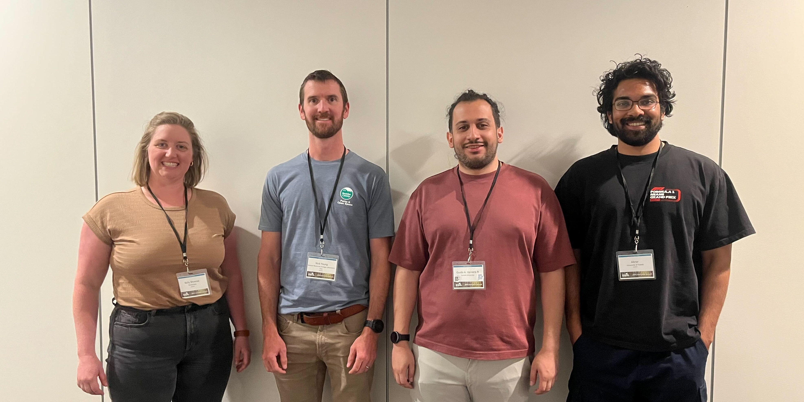
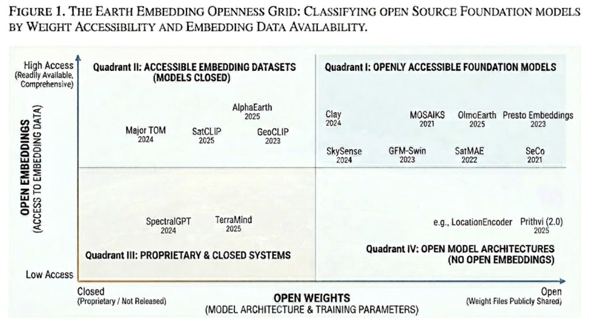

!!! tip "How to use this page during the Summit"
    - This page is your team’s shared workspace and final report-out page. It captures your group’s process and thinking throughout the Summit and will be used to share your work with others. 
    
    - Use this page as your team’s working record during the Summit and your final report-out.
    
    - The Summit has several different goals and thus you will use the page differently each day: Day 1 is for alignment, Day 2 is for building one useful thing, and Day 3 is for synthesis and report- out.
    
    - Look for the green buttons to indicate what you need to edit. 
    
    - Megaphones 📣 indicate which items you will be presenting during the end-of-day report-outs.

    - Only the items with megaphones will be visible when you hit the 'Summit Report Out' button. 

    - If you turn off 'Instructions' then you will only see the page content for public display.
    

# Team 6 Home: Embedders (Breadth)

!!! tip "For ESIIL staff"
    Group Number: 6
    
    Breakout Room #: S140

    [ESIIL staff edit in Markdown](https://github.com/CU-ESIIL/Summit_group_2026_6/edit/main/docs/index.md?plain=1#L28){ .md-button target="_blank" rel="noopener" }
    

[See a completed example](example.md){ .md-button }

## People { #people .oasis-report-out-context }

| Name | Affiliation | Contact | Github |
|---|---|---|---|
| Kelly Shreeve | DrivenData | kelly@drivendata.org | kellyshreeve |
| JuanSe Lozano | FIU | juanlozanov@gmail.com | juanlozanov |
| Abrar Hossain | UToledo | abrarhossainhimself@gmail.com | abrarhossainhimself|
| Guido A. Herrera-R | Cornell | gah234@cornell.edu | guidohero |
| Aleksander Berg | University of Colorado Boulder | aleksander.berg@colorado.edu | alekberg |
| Nick Young | Colorado State University | nicholas.young@colostate.edu | nickyoung2332 |

## Team Norms and Decision Making { #team-norms-and-decision-making }

Our team norms:

- Single slack channel, communicate over slack by @ing.
- Some test cases (depth) may illustrate the inventory (breadth) group, but they do not have to be shared in the larger paper (it is okay to keep your case study independent)
- Step up, step back / even turn taking

Our decision making strategy:

- Love it, Like it, Loath it... 1 - 4 voting

AI norms:

- Research/exploration
- Code snippets and claude code/codex/copilot ok (don't give sensitive data)
    - Prefer claude, gemini, cyverse and copilot with anthropic activated, if possible
- Editing/polishing/reviewing work (read after the edit)
- Create documentation like READMEs
- Not for first pass writing of papers

## Our product(s) 📣 { #product-direction .oasis-report-out-section .oasis-report-out-day2 }

Short term:

- Fill in [Google sheet tracker](https://docs.google.com/spreadsheets/d/1txBR827uQqRaOKPNIJP_qfkJvdxnDKkJxMFVUPPzzZI/edit?gid=1584353463#gid=1584353463)

Long term:

- Guidebook
- Review paper
- Systematic test/benchmarking

*Morning whiteboard or notes showing the question, hypotheses, and context we used to start Day 2.*

## Our question(s) 📣 { #project-question .oasis-report-out-section .oasis-report-out-day2 }

Our working question:

- What is the current state of earth embeddings? 
    - What models exist?
    - What are they good for?
- What are earth embeddings and how do explain them?

What would count as progress:

- Create a matrix to track models
- A mostly complete table

## Why this matters (the “upshot”) 📣 { #why-this-matters .oasis-report-out-section .oasis-report-out-day2 }

This matters because:

- To use earth embeddings, we need to know what's out there and how to choose from what's available.

People who could use this:

- People new to earth embeddings
- Researchers
- Data scientists

## Data sources we’re exploring 📣 { #data-exploration .oasis-report-out-section .oasis-report-out-day2 }

Promising data sources:

- [Google sheet tracker](https://docs.google.com/spreadsheets/d/1txBR827uQqRaOKPNIJP_qfkJvdxnDKkJxMFVUPPzzZI/edit?gid=1584353463#gid=1584353463)

### Challenges identified

- The number of foundational models available
- Logical ways to categorize them

## Team Photo { #team-photo }

*Team members and collaborators who contributed to this project.*

## Findings at a glance 📣 { #findings-at-a-glance .oasis-report-out-section .oasis-report-out-day3 }

### Earth Embeddings Datasets and Foundation Models

#### Educational Podcast

- We fed model literature to NotebookLM and developed two, easily interpretable podcasts on earth embeddings.
    - [Podcast link](https://notebooklm.google.com/notebook/703f34da-568c-409a-a9f6-27d3bfbc4ffd/artifact/77e40fd9-6fed-4793-ace9-48d1f4411258?utm_source=nlm_web_share&utm_medium=google_oo&utm_campaign=art_share_1&utm_content=&utm_smc=nlm_web_share_google_oo_art_share_1_)
    - [Podcast link 2](https://notebooklm.google.com/notebook/c8980247-a5c0-4008-9a38-dd8b4d36aef3/artifact/bcf948f8-364e-49d0-85fd-54fa1ec0670f?utm_source=nlm_web_share&utm_medium=google_oo&utm_campaign=art_share_1&utm_content=&utm_smc=nlm_web_share_google_oo_art_share_1_)

#### Summary Guide

* *Note*. Created with nano-banana. Accuracy should be verified.

#### In-depth Inventory of 26 current models

- A [Google Sheet](https://docs.google.com/spreadsheets/d/1n2m52Y0c-6Qvu8e1Gbq4V-Xg64qNjRKlH8BLTb-PEy4/edit?gid=1584353463#gid=1584353463) with resources, models, and tutorials.
    - **Resources**: collection of 12 resources, including academic papers and software tools.
    - **Models**: a matrix of the characteristics, input data, and use cases for 26 earth embeddings datasets and foundation models.
        - Useful for determining which embedding dataset or foundation model to select for research projects.
        - It includes well-known models such as Clay, Prithvi, and MOSAIKS, as well as specialized ones like AlphaEarth, SpectralGPT, and SatCLIP.
        - The sheet provides granular technical details for each model, including their training datasets (e.g., Landsat 8/9, Sentinel-2), spatial resolution, and whether they offer pre-trained embeddings.
    - **Tutorials**: Useful code tutorials for Alpha Earth and MOSAIKS.
        - These tutorials cover practical applications such as Unsupervised Classification, Regression, and Similarity Search, providing a bridge from theoretical models to real-world geospatial analysis.

## What’s next? 📣 { #whats-next .oasis-report-out-section .oasis-report-out-day3 }

Short term:

- Confirming and standardizing model data that AI filled in

Long term:

- Synthesizing the data
- Developing a how-to-choose guide

Who should see this next

- Bring back to our organizations

## Cite & Reuse { #cite-reuse }

If you use these materials, please cite:

Summit Team. (2026). *Summit Group 2026 Team 6 — Innovation Summit 2026*. https://github.com/CU-ESIIL/Summit_group_2026_6

License: CC-BY-4.0 unless noted. 
